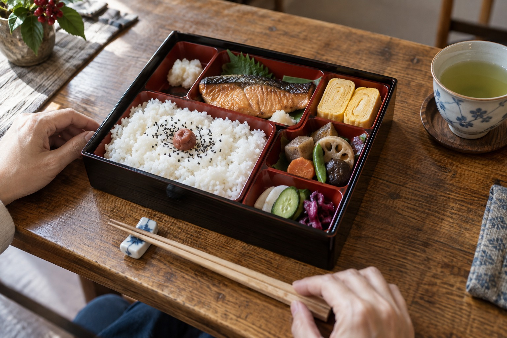
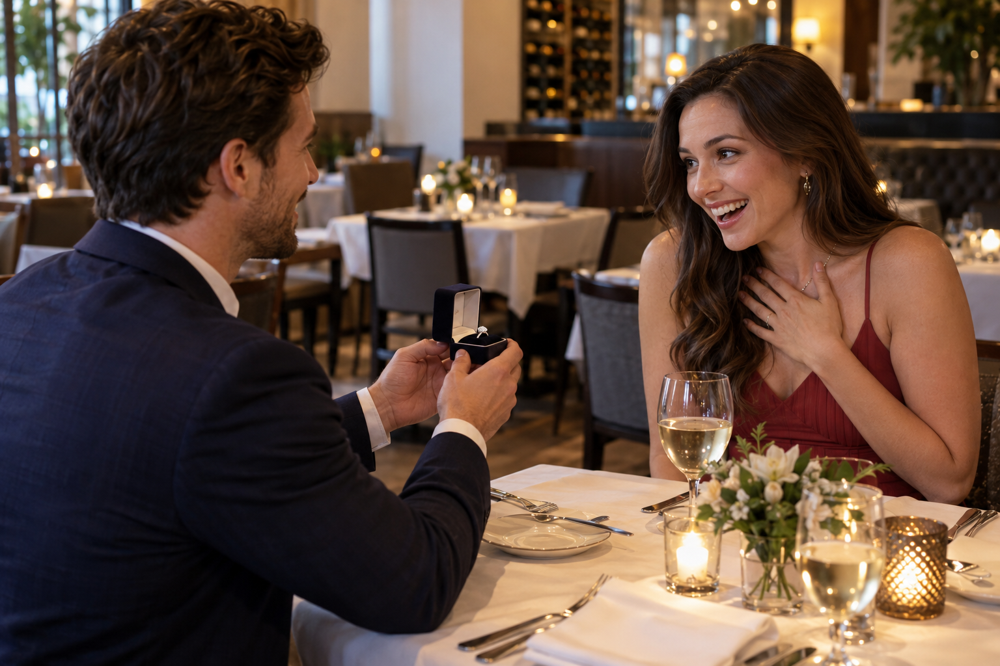

# Jev vs OpenAI Decisions API、画像判定も試してみた

0.3秒の応答と画像判定で見えた実力

Jevと同じように、選択肢から答えを選ぶ意思決定API「Decisions API」が2026年10月6日にOpenAIからリリースされたので、テストしてみました。

まずはテキストの判定です。身近なクイズや経費精算の規程など120問を使い、Decisions APIとJevを比較しました。次に、画像10問でDecisions APIと通常のLunaを比較します。それぞれの正解率、応答時間、費用を見ていきます。

## 1. テキストの判定：Decisions APIとJev

### 1-1. 一般的な質問を120問用意

AIの比較は、問題が専門的すぎると、この記事を読んでいただいている方には結果を判断しにくくなります。そこで、お釣り、映画の終了時刻、言葉の意味など、自分でも答えを確かめられる問題を選びました。

歴史や地理、国語、音楽など10題材で100問。内訳は知識30問、文章判断40問、計算30問です。さらに、仕事の状況判断10問、架空の経費精算規程に基づく判定10問を加え、合計120問にしました。

すべて4択で、正解は測定前に固定しています。両モデルへ同じ問題を3回ずつ送り、各360試行、合計720試行。正解や解説は送りません。状況判断は利用者が決めた想定正解との一致を採点しており、計算の唯一の正解とは性質が違います。

経費精算の問題では、第1条から第8条までの規程全文を、問題文と選択肢と一緒に毎回送っています。前の質問で規程を覚えている、という前提にはしていません。

今回行ったテストの詳細は全てGitHubで公開していますので、そちらも併せてご参照ください。

[実際に利用した問題と回答はこちらです](https://takeshiue.github.io/decisions-benchmark/)

### 1-2. 約0.3秒、90%以上の正解率

| モデル | 正解／試行 | 正解率 | 応答時間の中央値 | p95 |
|---|---:|---:|---:|---:|
| OpenAI Decisions | 330／360 | 91.7% | 320ms | 514ms |
| Jev | 342／360 | 95.0% | 302ms | 439ms |

Jevには、返された確率の合計が応答検査を通らないケースが2回ありました。正解率の分母にはその2回も含め、速度は有効回答の358件から集計しています。OpenAIの速度は360件が対象。どちらも誤答の時間を含みます。720試行は完了していますが、検査失敗を含むため、測定の実行判定はFAILです。

### 1-3. 計算問題の正解率が悪い

| 問題の種類 | OpenAI | Jev |
|---|---:|---:|
| 知識30問×3回 | 100.0%（90／90） | 96.7%（87／90） |
| 文章判断40問×3回 | 100.0%（120／120） | 98.3%（118／120） |
| 計算30問×3回 | 73.3%（66／90） | 93.3%（84／90） |
| 状況判断10問×3回 | 100.0%（30／30） | 100.0%（30／30） |
| 規程判定10問×3回 | 80.0%（24／30） | 76.7%（23／30） |

OpenAIは今回の知識と文章判断では全問正解。一方、計算は8問を間違え、その8問すべてで3回とも同じ誤答でした。30回の誤答のうち24回、80%が計算問題に集中しています。

### 1-4. 質問のサンプル

どんな問題を出したのか、8問を紹介します。問題の種類を紹介するための選択で、全120問の比率や正解率を再現する標本ではありません。表の回答は、どちらのAPIも各問3回とも同じでした。規程判定では全8条の規程全文を毎回送っています。

| 例・種類 | 問題 | 選択肢 | 正解 | OpenAI Decisions | Jev | コメント |
| --- | --- | --- | --- | --- | --- | --- |
| 1（知識） | シドニーと迷いがちですが、オーストラリアの首都は？ | A．シドニー ／ B．メルボルン ／ C．キャンベラ ／ D．ブリスベン | キャンベラ | キャンベラ | キャンベラ | 両APIとも正解 |
| 2（知識） | 「役不足」を、本来の意味で使った説明は？ | A．本人の能力が足りず役目が重すぎる ／ B．本人の能力に比べて役目が軽すぎる ／ C．役者の人数が足りない ／ D．役目が一つもない | 本人の能力に比べて役目が軽すぎる | 本人の能力に比べて役目が軽すぎる | 本人の能力が足りず役目が重すぎる | Jevは不正解 |
| 3（文章判断） | 架空の街の地図です。駅の北に図書館、図書館の東に公園、公園の南にカフェがあります。カフェは駅から見てどちらにありますか？ 各移動の距離は同じです。 | A．東 ／ B．西 ／ C．北 ／ D．南 | 東 | 東 | 東 | 両APIとも正解 |
| 4（文章判断） | 架空の商人の日記に「朝市で売れたのは反物と茶。米は売らず、塩は買った」とあります。「売った品物だけ」の組合せは？ | A．反物と茶 ／ B．米と塩 ／ C．反物と塩 ／ D．茶と米 | 反物と茶 | 反物と茶 | 反物と茶 | 両APIとも正解 |
| 5（計算） | 縮尺5万分の1の地図で、駅から湖までの道の長さが6cmでした。実際の道の長さは？ | A．3km ／ B．300m ／ C．1.5km ／ D．30km | 3km | 3km | 3km | 両APIとも正解 |
| 6（計算） | 120円のお菓子を3個買い、500円払いました。お釣りは？ | A．120円 ／ B．160円 ／ C．180円 ／ D．140円 | 140円 | 160円 | 140円 | OpenAI Decisionsは不正解 |
| 7（状況判断） | 自社SaaSで全顧客に影響する障害が発生。原因は調査中で復旧見込みは不明。問い合わせが急増している。 | A．原因が判明してから告知する ／ B．問い合わせに1件ずつ個別に回答する ／ C．影響が一部だと判断できるまで静観する ／ D．ステータスページ等で障害発生と調査中である旨を即時告知する | ステータスページ等で障害発生と調査中である旨を即時告知する | ステータスページ等で障害発生と調査中である旨を即時告知する | ステータスページ等で障害発生と調査中である旨を即時告知する | 状況判断は利用者の想定正解との一致。両APIとも想定正解に一致 |
| 8（規程判定） | 取引先2名と自社1名で会食、合計18,000円。領収書あり。支出から5日後に申請。 | A．承認 ／ B．上長承認が必要 ／ C．却下 ／ D．本規程の対象外 | 上長承認が必要 | 承認 | 承認 | 架空規程：会食費は自社参加者も人数に含め、1人5,000円以下は承認、5,000円超〜10,000円以下は上長承認が必要、10,000円超は却下。領収書と60日以内の申請が必要。この例は18,000円÷3人＝6,000円。領収書・期限の条件も満たすため、上長承認が必要です。 |

首都の知識や、文章に書かれた条件からの判断は両APIとも正解でした。一方、お釣りの計算ではOpenAI Decisionsが、「役不足」の意味ではJevが不正解です。同じ質問をもう一度送るだけでは、これらの誤答は変わりませんでした。

Jevにも計算の誤答はあります。大人800円、中学生400円の博物館に、大人2人と中学生3人で入り、5000円払った場合のお釣りは2200円ですが、1800円と回答しました。また、「役不足」の本来の意味も逆に選んでいます。どちらも3回とも同じ誤答でした。

経費精算でも、両者に共通する間違いがありました。取引先2人と自社1人で18,000円の会食をすると、1人あたり6,000円。今回の架空規程では上長承認が必要ですが、両者とも3回すべて「承認」と答えました。

規程全文を渡しても、計算を含む判定が正しくなるとは限らないわけです。ただ、人数の読み取り、割り算、金額帯への当てはめのどこで間違えたのかは、回答だけからは分かりません。

### 1-5. テキスト120問にかかったコストは

テキストの本測定については、OpenAIが360試行で約1.31円。Jevは使用量を記録できた358回答分で約1.10円でした。どちらも今回の規模なら、従量料金は1円ちょっとという感覚です。

## 2. 次に、画像の判定：Decisions APIと通常のLuna

文章の次は、画像です。写真風の生成画像10枚を使って、物の種類、人物の動作、位置関係、個数、時計の時刻などを試しました。ここはJevとの比較ではなく、OpenAIのDecisions APIと通常のLuna（Responses API）の比較です。

両方の返却モデル名はgpt-6-luna。同じ画像・設問・4択を各3回ずつ送り、各30試行、合計60試行です。通常のLunaは速度を重視して推論設定を「none」にし、選択肢の名前だけを返す条件にしました。通常の推論設定での比較ではありません。

| 画像10問の結果 | Decisions API | 通常のLuna |
|---|---:|---:|
| 正解／試行 | 30／30 | 27／30 |
| 正解率 | 100.0% | 90.0% |
| 全体時間の中央値 | 754ms | 2,499ms |
| p95 | 1,123ms | 4,997ms |
| 従量料金の推計 | 約0.84円 | 約0.42円 |

この条件では、Decisions APIは約0.75秒、通常のLunaは約2.50秒で回答が揃いました。中央値で比べると、Decisions APIの待ち時間は約3分の1です。通信や画像ファイルの読み取り、送信用のBase64変換、回答の確認までを含みます。Base64変換だけの中央値は約10msと18msで、変換を除いても差は残ります。

実際の画像から、「お弁当」「柱時計」「プロポーズ」の3問を紹介します。画像はすべてAIで制作したもので、実写写真ではありません。HTMLでは左に画像、右に設問と選択肢を並べています。

### 2-1. サンプル1：この画像のお弁当は、どの種類ですか？

A．幕の内弁当 ／ B．のり弁当 ／ C．カツ丼 ／ D．サンドイッチ弁当

想定正解：A．幕の内弁当。

Decisions API：幕の内弁当（3回とも）。通常のLuna：幕の内弁当（3回とも）。

### 2-2. サンプル2：柱時計は何時を示していますか？

A．3時20分 ／ B．4時15分 ／ C．3時40分 ／ D．4時20分

想定正解：A．3時20分。

Decisions API：3時20分（3回とも）。通常のLuna：4時20分（3回とも）。

### 2-3. サンプル3：この男性は何をしているところでしょう？

A．料理を注文している ／ B．プロポーズしている ／ C．仕事の資料を説明している ／ D．食事代を精算している

想定正解：B．プロポーズしている。

Decisions API：プロポーズしている（3回とも）。通常のLuna：プロポーズしている（3回とも）。

柱時計は、部屋と人物も写る少し斜めからの画像です。長針は4、短針は3と4の間を示しているので、正解は3時20分。Decisions APIは3回とも正解でしたが、通常のLunaは3回とも4時20分と答えました。今回の通常のLunaの誤答3件は、この1枚に集中しています。だから「画像全般で10%間違える」という読み方はできません。

プロポーズの問題は、2人の関係を聞くと「夫婦が指輪を贈っている」という解釈も成立するため、男性が何をしている場面かを問いました。誕生日プレゼントなど紛らわしい選択肢も避けています。両APIとも3回すべて、想定正解のプロポーズを選びました。ただし、画像から行動の意図を完全に確定できるわけではないので、時刻や個数の唯一解とは区別した「制作した場面の想定正解との一致」です。

10番を分けて見ると、1〜9番の27試行ではDecisions APIが27／27、通常のLunaが24／27。プロポーズは両者3／3でした。通信・拒否・回答形式の失敗はありません。

費用は各30試行の観測使用量からの推計で、請求額ではありません。通常のLunaでは入力キャッシュが使われ、その料金を反映しています。毎回異なる画像を送る場合も同じ費用差になるとは限りません。画像生成費用は含めていません。

独立した画像は10枚だけです。前半5枚はJPEG、後半5枚はPNGで、画像の内容・形式・容量や通信条件を含む比較です。モデル名が同じでも、使うAPIと設定で応答時間と回答が変わった、という今回の観測として受け止めたいところです。

## 3. 画像判定の精度の高さに驚いた

テキスト120問では、Decisions APIもJevも約0.3秒で回答し、正解率は90%を超えました。全体の正解率はJevの方が高く、特に計算問題で差がつきました。答えがすぐ返ってくる使い心地は良いものの、身近な算数でも間違えることがある点は気になりました。

Decisions APIは今回の画像10問を各3回、計30回試して100%正解でした。お弁当の中身や柱時計の時刻だけでなく、指輪を渡す場面をプロポーズと判定できたことに驚きました。画像に写っている物体の認識に加え、その場で何が起きているかという文脈も読み取れる点が印象に残りました。

画像判定の料金は通常のLunaの方が安くなりましたが、同じ問題を繰り返した際のキャッシュ利用が影響しています。今回は画像10問での結果なので、別の画像や、もっと判断に迷う場面でも試してみたいところです。テキストと画像を両方試したことで、応答の速さだけでは分からない得意な問題と、確認が必要な問題が見えてきました。
